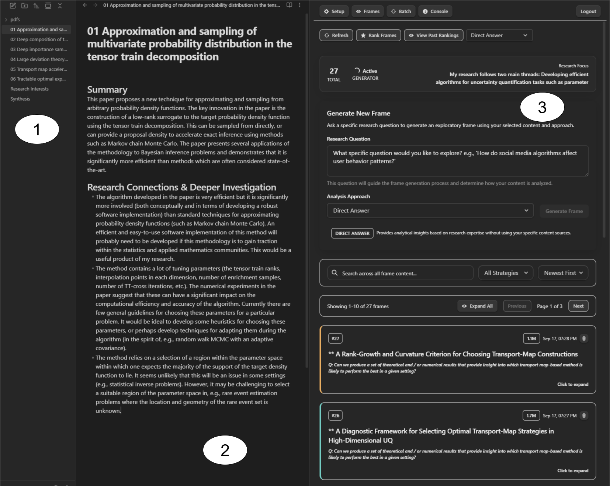
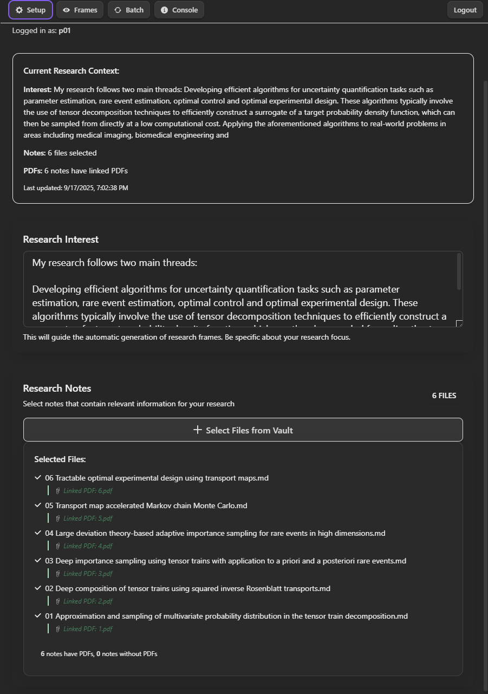
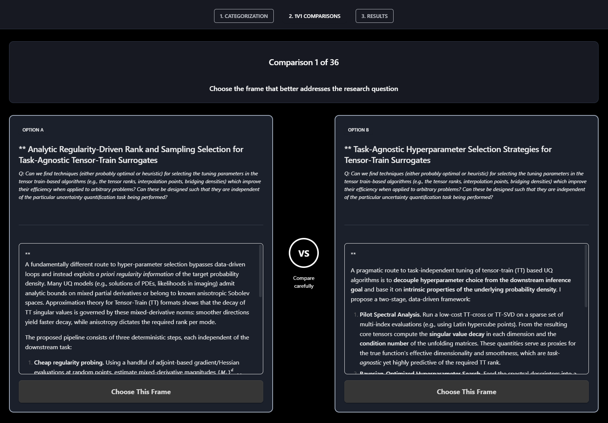
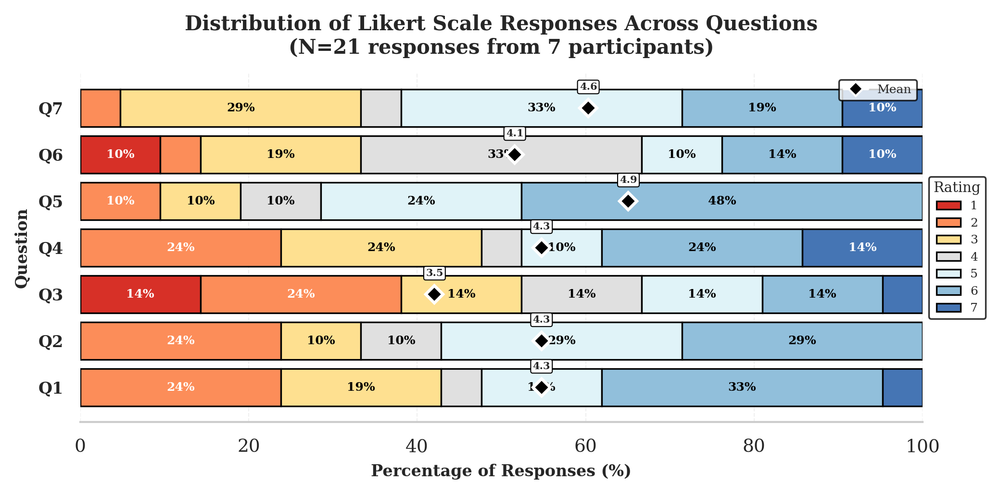
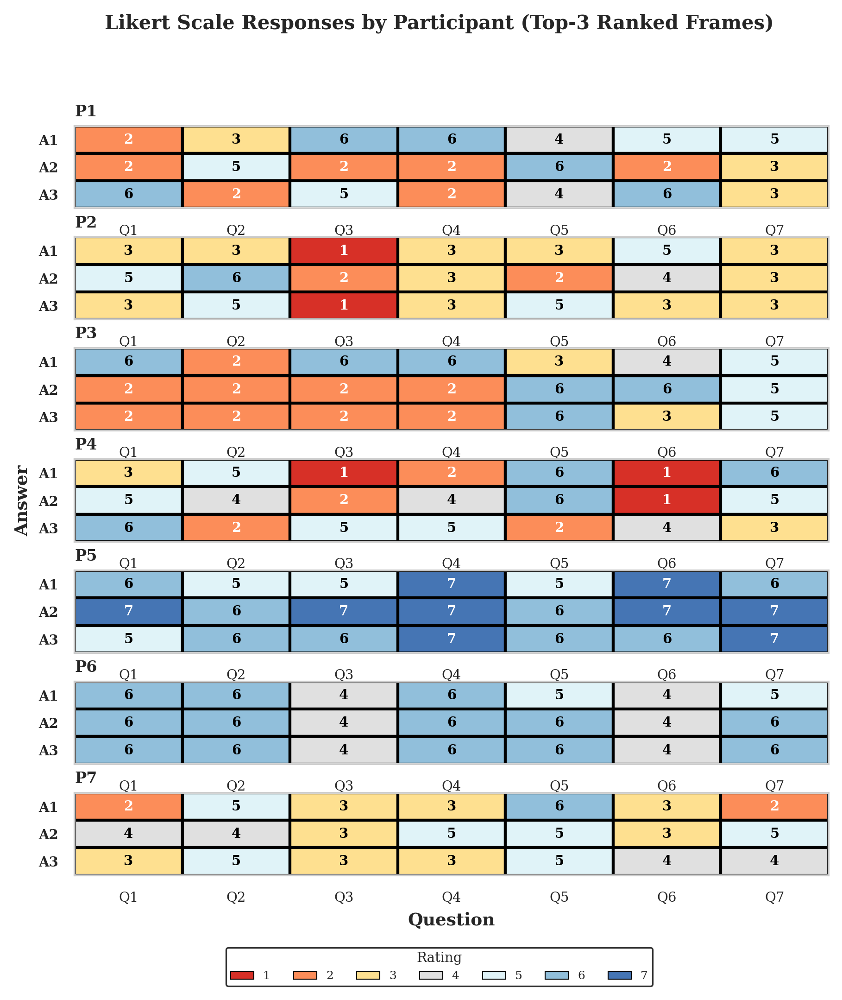

# Research Frames

Research Frames is an AI-assisted tool for computational creativity research. It surfaces novel research perspectives by analysing a researcher's own notes and PDFs alongside retrieved academic literature, then synthesising concise "answers".

*Side-by-side view of a researcher's annotated notes (left) alongside the frame browser and generation interface (right).*

*Setup view where the user enters their research interest and selects notes and linked PDFs from their vault.*

*Batch evaluation interface for pairwise 1v1 comparison of generated frames.*

## AI Disclaimer

Claude Code (Anthropic) was heavily used to assist in the development of both the frontend (Obsidian plugin) and the backend (FastAPI server). All generated code was reviewed and integrated by the authors.

## Repository structure

| Folder | Description |
|---|---|
| `obsidian_plugin/` | Obsidian plugin (React/TypeScript) — the user-facing interface |
| `obsidian_plugin_backend/` | FastAPI backend — LLM-based frame generation, task queue, database |
| `Additional_Figures_and_Prompts/` | Supplementary figures and LLM prompt listings from the paper |

See the README in each sub-folder for setup and run instructions.

## Additional Figures and Prompts

### `figure_likert_distribution.png`

Stacked bar chart showing the distribution of 7-point Likert scale responses across all seven evaluation questions (Q1–Q7), aggregated over N=21 responses from 7 participants (3 frames per participant). Each bar shows the percentage of responses at each rating level (1–7), with a diamond marker indicating the per-question mean. Means range from 3.5 (Q3) to 4.9 (Q5).

### `figure_per_participant_panels.png`

Grid showing individual Likert responses broken down by participant (P1–P7) and frame (A1–A3) across all seven questions (Q1–Q7). Each cell contains the numeric rating and is colour-coded on the same 1–7 scale, allowing per-participant and per-frame response patterns to be compared directly.

### `Prompts.pdf`

Complete listing of all LLM prompts used in the study. Includes the PDF summarisation prompt (used to condense academic papers into 800–1000 word context summaries) and the three frame generation strategy prompts:

- **Strategy 1 — Direct Answer:** baseline prompt using only the research interest and question, no notes or PDFs.
- **Strategy 2 — All Content:** prompt supplied with the full text of all selected notes and PDFs alongside the research question.
- **Strategy 3 — Dorst's Frame:** four-step sequential prompt chain (Archaeology → Paradox → Context → Frame) based on Dorst's frame creation methodology, with each step building on the outputs of the previous ones.

### `Note_taking_guide.pdf`

Guide distributed to participants in Session 1 to support structured note-taking on previously read papers. Describes four note types — *Summary*, *Research Connections*, *Deeper Investigation*, and *Surprising Result / Unexpected Finding* — each with concrete cases and worked examples. Participants were free to follow the guide or take notes in their own style.
